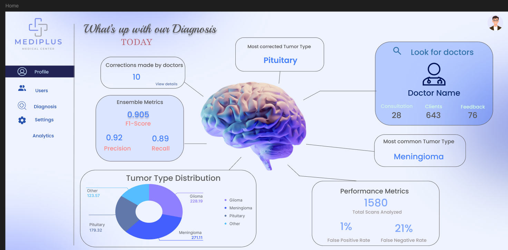
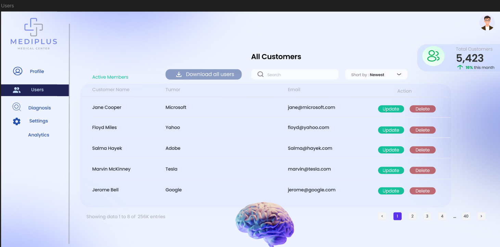
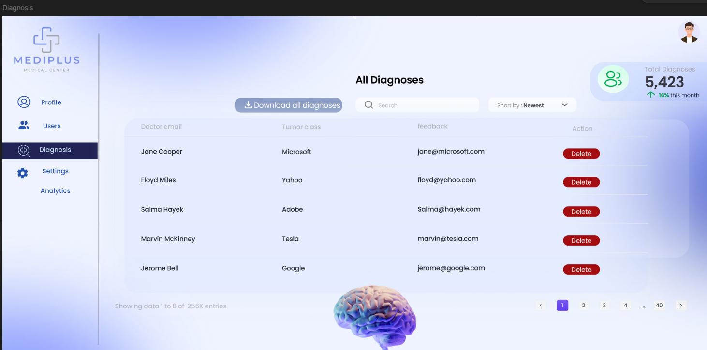

# 🧠 MRI Brain Tumor Detection Web App  

An advanced **AI-powered web platform** for **MRI brain tumor detection**, combining **deep learning**, **machine learning**, **data analytics**, and **interactive visualization**.  
Built with **Flask**, **PyTorch**, **Power BI**, and **MongoDB**, this system achieves **92% accuracy** and delivers **real-time diagnostic insights** through a sleek, data-driven admin dashboard.  

---

## ✨ Project Highlights  

💡 **Multi-model Benchmarking** — PCA+Random Forest, Custom CNN, and Transfer Learning (ResNet18)  
📊 **Dynamic Power BI Dashboard** — interactive analytics connected to live MongoDB data  
🧠 **High-Performance Model (92%)** — optimized for early tumor detection and multi-class classification  
🔐 **Role-Based Authentication** — secure access for users and admins  
🎨 **Figma-Designed Admin UI** — modern design integrated with Power BI charts  
🌐 **End-to-End Web App** — from MRI upload to automated diagnosis and visualization  

---

## 🚀 Overview  

This project tackles the challenge of **automated brain tumor detection** using MRI imagery.  
Through the synergy of **deep learning (CNNs)** and **transfer learning (ResNet18)**, the system accurately classifies MRI scans into tumor categories:  
**Glioma**, **Meningioma**, **No Tumor** , and **Pituitary**.  

The web app provides a **real-time diagnosis portal** for users and a **smart analytics dashboard** for admins — seamlessly combining **AI predictions, data visualization**, and **database-driven updates**.

---

## 🎯 Key Features  

- 🩻 **MRI Image Upload & Instant AI Diagnosis**  
- ⚙️ **Three Benchmark Models:**
  - 🧩 **PCA + Random Forest** → baseline model  
  - 🧠 **CNN** → custom convolutional neural network  
  - 🚀 **Transfer Learning with ResNet18** 
- 📊 **Power BI Integration**:
  - Live dashboards synced with **MongoDB**  
  - Auto-refresh charts showing user activity, model performance, and diagnosis trends  
- 🧮 **Multi-class Tumor Detection** (Glioma, Meningioma, Pituitary , no Tumor)  
- 👥 **Role-Based Access Control** (User / Admin)  
- 🧰 **Admin Dashboard Features:**
  - Overview of predictions  
  - User management  
  - Diagnosis analytics (interactive Power BI visuals)  
- 🎨 **Clean UI** designed with **Figma** and **Bootstrap**

---

## 🛠️ Tech Stack  

| Category | Tools & Frameworks |
|-----------|--------------------|
| **Backend** | Flask (Python) |
| **AI Models** | PyTorch, scikit-learn |
| **Data Storage** | MongoDB |
| **Visualization** | Power BI, Matplotlib, Seaborn |
| **Frontend** | HTML, CSS, JavaScript, Bootstrap |
| **Design** | Figma |
| **Version Control** | Git, GitHub |

---

## ⚙️ Workflow  

1. **Data Preprocessing** – normalize and clean MRI datasets  
2. **Model Development** – train and evaluate PCA+RF, CNN, and ResNet18  
3. **Benchmarking** – compare performance metrics and select best model  
4. **Database Integration** – connect prediction results to **MongoDB**  
5. **Visualization Layer** – sync Power BI dashboard for live analytics  
6. **Deployment** – launch on Flask for real-time user interaction  

---

## 🧠 Model Benchmark Results  

| Model | Type | 
|--------|------|
| PCA + Random Forest | Classical ML |
| CNN | Deep Learning |
| **ResNet18 (Transfer Learning)** | **Deep Transfer Learning** |

---

## 📊 Admin Dashboard (Figma + Power BI Integration)

### 🏠 Home Page  

### 👥 Users Management  

### 🧪 Diagnosis Overview  

---

## 🧩 Tumor Detection Interface  

  
  

---

## 📈 Real-Time Analytics  

- Power BI dashboard automatically **syncs with MongoDB**  
- Dynamic visualization of:
  - Model accuracy evolution  
  - Diagnosis frequency and class distribution  
  - User activity metrics  
- Provides admins with **live monitoring** and **decision-support analytics**

---

## 👩‍💻 Authors  

**Tesnime Ellabou**  
**Asma Daab**

---

## 🏆 Recognition  

> A comprehensive AI-driven medical imaging project integrating **Machine Learning, Deep Learning, Data Visualization, and Web Development** — delivering an end-to-end intelligent healthcare solution.

